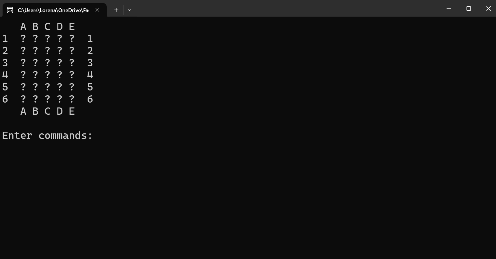

# Minesweeper-Game-in-C

This is a terminal-based implementation of the classic Minesweeper game. The game does not feature a graphical interface; instead, the board is displayed in the terminal, updating dynamically after each move.

### Project Purpose
This project was created as part of my journey to learn the C programming language. It focuses on essential concepts such as data structures, memory management, and logic implementation in C.

### How to Use
The repository contains two main folders:
- **Game/**: This folder contains the executable file for those who wish to play the game directly.
- **Code/**: This folder contains the full source code implementation of the game.
